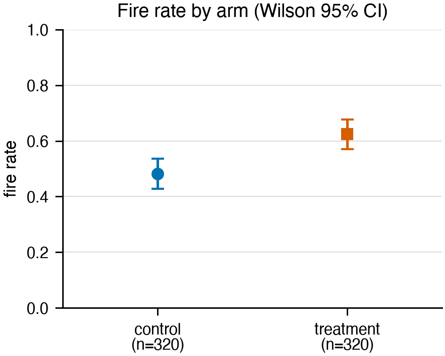

# Untitled Research Project

<!-- The paper SOURCE lives here and is committed. The rendered PDF is a build
     artifact and is gitignored: a PDF you cannot regenerate is a paper you
     cannot amend, fork, or diff. -->

**Authors.** Yasin Edin

## Abstract

Five sentences, in this order: (1) the context a reader already accepts, (2) the
gap or tension in it, (3) what you did, (4) what you found, with the number,
(5) why it matters. Write this last and rewrite it most.

## 1. Introduction

One to one-and-a-half pages. End the introduction with an explicit, enumerated
list of contributions — each one a specific, falsifiable claim, not "we study X".

**Contributions.**
1. ...
2. ...

## 2. Method

Enough detail that someone could rebuild this without asking you a question.
State the arms, what is held fixed, the sample size and why that size, the
statistic, and the precision or configuration every number was measured at.

## 3. Results

One subsection per claim in `CLAIMS.md`. Every rate carries an interval. Every
comparison names its control. Captions carry the takeaway, not a restatement of
the axes.

The table and figure below are placeholders showing the two conventions
`scripts/build_paper.py` relies on. Keep them until you have real ones: they are
what makes `just paper` exercise the table and float paths on a fresh clone,
rather than only the prose path.

**Table 1.** Table captions go *before* the table, and start with a bold
`**Table N.**`. That prefix is what binds the caption to the table so a page
break cannot separate them.

| Arm | Fired | Rate | 95% CI |
|---|---|---|---|
| `control` | 154/320 | 48.1% | [42.7%, 53.6%] |
| `treatment` | 200/320 | 62.5% | [57.1%, 67.6%] |

**Figure 1.** Figure captions go *after* the image and start with a bold
`**Figure N.**`. The number is stripped during conversion because Typst floats
the figure and numbers it itself. Write the takeaway here, not a description of
the axes.

## 4. Limitations

Written before anyone asks. Name the strongest argument against your own result
and say what would settle it. A limitations section that only lists things that
do not matter is a signal in itself.

## 5. Conclusion

What changed, and what you would do next with another week.

## Reproducibility

Code, data and the claim-to-artifact map are in the repository. See `CLAIMS.md`
for the binding between every number quoted here and the script that produced it.
